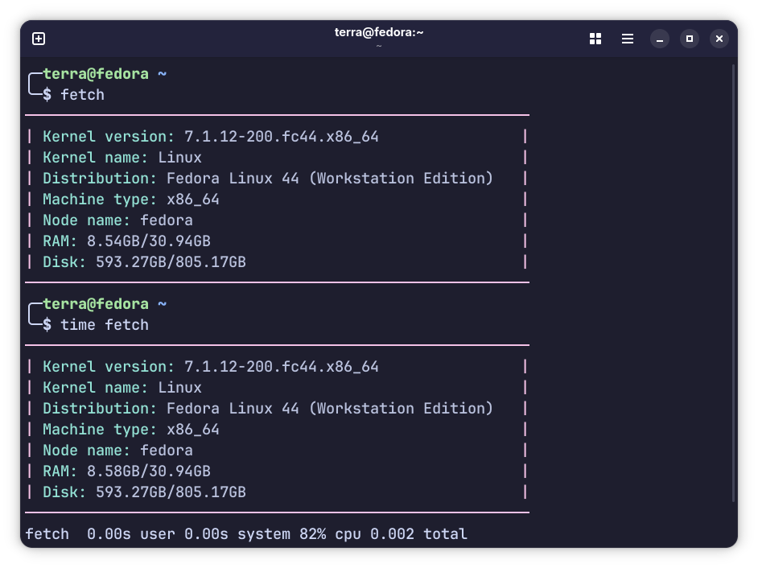

# fetch

fetch is a fetch program for Linux, made for learning purposes. In C.

<p align="center">
	
</p>

## Building
```bash
gcc -O3 fetch.c -o fetch
```

## TODO
#### Note that I don't plan on adding ASCII art since that would be a lot of work.
- [x] Distribution name
